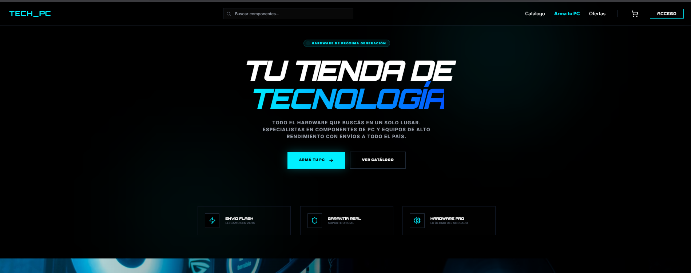
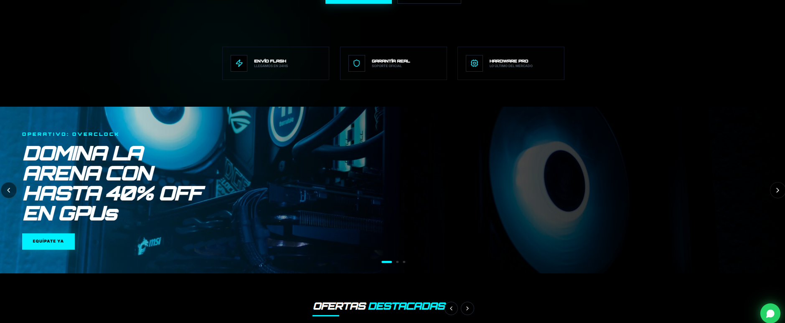
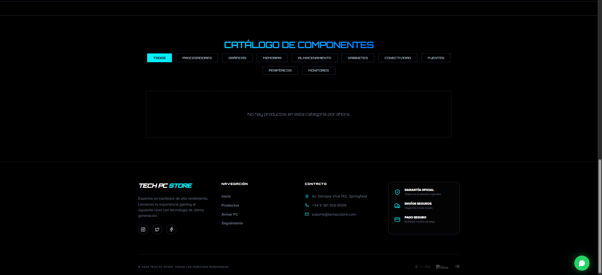

# 💻 Tech PC Store - E-Commerce Platform

Una plataforma de comercio electrónico moderna, de alto rendimiento y lista para producción, diseñada para la venta de componentes de PC y tecnología. 

**Tech PC Store** ofrece una experiencia de usuario (UX) futurista y premium, con un tema oscuro elegante, navegación fluida, gestión de carrito de compras, autenticación segura y procesamiento de pagos integrado.

## 📸 Capturas de Pantalla

*(Nota: Para que estas imágenes se vean correctamente en tu GitHub, asegúrate de guardar las capturas que me enviaste en la carpeta `public/` de tu proyecto con los nombres indicados)*

### 1. Inicio y Navegación
<div align="center">
  
  <br><em>Vista Principal y Buscador</em>
</div>
<br>

### 2. Ofertas y Banners
<div align="center">
  
  <br><em>Sección de Promociones y Carrusel</em>
</div>
<br>

### 3. Catálogo y Footer
<div align="center">
  
  <br><em>Exploración de Componentes y Pie de Página</em>
</div>

## 🚀 Características Destacadas

- **Diseño Premium y Futurista:** Interfaz de usuario (UI) moderna con modo oscuro, tipografía pulcra y micro-animaciones para una experiencia inmersiva.
- **Catálogo de Productos y Carrito:** Exploración intuitiva de productos, adición rápida al carrito, cálculo de totales y opción de vaciar el carrito.
- **Autenticación Segura:** Sistema de registro e inicio de sesión de usuarios respaldado por Supabase Auth.
- **Gestión de Base de Datos:** Base de datos relacional PostgreSQL (Supabase) con políticas de Seguridad a Nivel de Fila (RLS) para proteger los datos de usuarios, productos y pedidos.
- **Pagos Seguros:** Integración completa con Stripe para procesar transacciones de forma segura y confiable.
- **Gestión de Estado Global:** Uso de Zustand para manejar el estado del carrito y la sesión del usuario a lo largo de toda la aplicación.
- **Totalmente Responsivo:** Experiencia de compra perfecta en dispositivos móviles, tablets y escritorios.

## 🛠️ Tecnologías Utilizadas

Este proyecto utiliza un stack tecnológico moderno, escalable y robusto:

### Frontend
- **Framework:** [Next.js 14](https://nextjs.org/) (App Router)
- **Librería de UI:** [React 18](https://react.dev/)
- **Estilos:** [Tailwind CSS](https://tailwindcss.com/)
- **Gestor de Estado:** [Zustand](https://zustand-demo.pmnd.rs/)
- **Animaciones:** [Framer Motion](https://www.framer.com/motion/)
- **Iconografía:** [Lucide React](https://lucide.dev/)

### Backend & Servicios
- **Base de Datos & Autenticación:** [Supabase](https://supabase.com/) (PostgreSQL & Supabase SSR)
- **Procesamiento de Pagos:** [Stripe](https://stripe.com/)
- **Envío de Correos (Opcional/Integrable):** [Resend](https://resend.com/)

## 📂 Arquitectura y Organización

El proyecto sigue las mejores prácticas de la arquitectura App Router de Next.js:

```text
TechPCStore/
├── src/
│   ├── app/             # Rutas, layouts y páginas principales de Next.js
│   ├── components/      # Componentes UI reutilizables (Botones, Tarjetas, Navbar)
│   ├── lib/             # Funciones de utilidad, configuraciones (Stripe, Supabase)
│   ├── store/           # Archivos de estado global (Zustand)
│   └── types/           # Definiciones de tipos de TypeScript
├── public/              # Archivos estáticos (imágenes, fuentes)
├── tailwind.config.js   # Configuración personalizada de temas y colores
└── middleware.ts        # Middleware para protección de rutas y manejo de sesiones
```

## ⚙️ Configuración Local

Para ejecutar este proyecto localmente, necesitarás configurar las variables de entorno para Supabase y Stripe.

1. **Clonar el repositorio y entrar al directorio:**
   ```bash
   git clone <url-del-repo>
   cd TechPCStore
   ```

2. **Instalar las dependencias:**
   ```bash
   npm install
   ```

3. **Configurar variables de entorno:**
   Crea un archivo `.env.local` en la raíz del proyecto y añade tus claves:
   ```env
   NEXT_PUBLIC_SUPABASE_URL=tu_supabase_url
   NEXT_PUBLIC_SUPABASE_ANON_KEY=tu_supabase_anon_key
   STRIPE_SECRET_KEY=tu_stripe_secret_key
   NEXT_PUBLIC_STRIPE_PUBLISHABLE_KEY=tu_stripe_publishable_key
   ```

4. **Ejecutar el servidor de desarrollo:**
   ```bash
   npm run dev
   ```

Abre [http://localhost:3000](http://localhost:3000) en tu navegador para ver el resultado.

---
*Construido para llevar el comercio de tecnología al siguiente nivel.*
